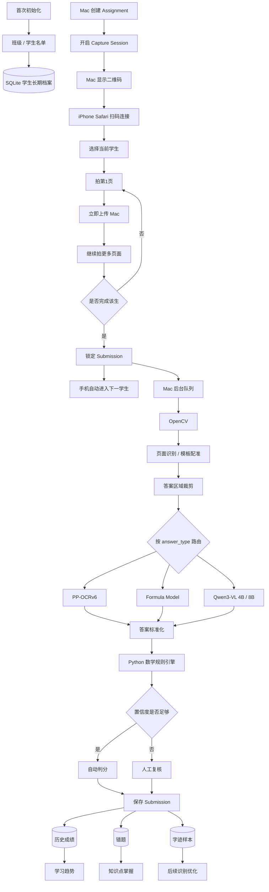

# 本地小学数学作业拍照批改系统
## 项目参考手册 / Architecture & Execution Playbook

**版本：v0.4**
**日期：2026-09-25**
**状态：当前项目主参考文档**  
**适用对象：项目本人、Codex、Workbuddy、其他开发模型、后续维护者**

> 本文档用于统一整个项目的产品逻辑、系统架构、开发顺序、模型路线、数据结构、测试标准和验收门槛。  
> 后续开发若与本文档发生冲突，必须先说明原因并更新本文档，不允许在代码中暗中改变核心逻辑。  
> 本文档中的模型、阈值和性能目标属于“当前基线”，最终必须以真实 Benchmark 数据为准。

---

# 0. 项目一句话定义

做一个**完全本地运行的小学数学作业拍照批改系统**：

- 班级和学生信息只录入一次；
- 老师日常用 iPhone 拍一个学生的多页作业；
- 手机负责采集，Mac 负责识别、判分、复核和长期分析；
- 拍完该学生全部页面后，老师主动点击“完成该生”；
- 系统才进入下一名学生；
- Mac 后台自动进行图像处理、OCR、公式识别、小型视觉模型复核和规则判分；
- 低置信度题目只进入极少量人工确认；
- 最终自动保存成绩、错题、知识点掌握情况和长期趋势；
- 系统正式运行不依赖云 API，也不依赖 27B 大模型。

---

# 1. 当前核心产品逻辑

## 1.1 首次初始化只做一次

```text
创建班级
↓
导入学生名单
↓
姓名 / 学号 / 年级 / 班级
↓
写入本地 SQLite
↓
自动建立每名学生长期档案
```

学生信息不在每次批改时重新录入。

支持：

- 手工录入；
- Excel 批量导入；
- 后续新增；
- 转班；
- 停用；
- 修改信息。

---

## 1.2 每次作业是 Assignment

例如：

```text
四年级1班
2026-09-20
练习册 第8课时
```

Assignment 代表：

> 一个班级在某次需要批改的作业任务。

---

## 1.3 每个学生的一次作业是 Submission

一个学生可能有：

- 1 页；
- 2 页；
- 3 页；
- 5 页；
- 更多页面。

因此不能：

```text
拍1页
↓
自动下一学生
```

正确逻辑是：

```text
当前学生：张三
↓
拍第1页
↓
拍第2页
↓
拍第3页
↓
老师确认：
“张三拍完了”
↓
点击「完成该生」
↓
张三 Submission 完成
↓
系统进入下一学生：李四
```

---

# 2. 手机与 Mac 的职责划分

## 2.1 iPhone

iPhone 主要负责：

- 拍照；
- 查看当前学生；
- 查看已拍页数；
- 重拍；
- 删除某页；
- 继续拍下一页；
- 点击“完成该生”。

iPhone 不负责：

- OCR；
- 大模型推理；
- 数学判分；
- 长期数据分析。

---

## 2.2 Mac

Mac 负责：

- 班级和学生管理；
- 创建 Assignment；
- 启动手机拍摄连接；
- 接收图片；
- 保存原始照片；
- 图像质量检查；
- OpenCV 预处理；
- 模板配准；
- 答案区域裁剪；
- OCR；
- Formula Recognition；
- Qwen3-VL 复核；
- 数学判分；
- 人工复核；
- 数据库；
- 错题统计；
- 学习趋势；
- 报告生成。

---

# 3. 推荐的手机—Mac 联动方案

## 3.1 主方案：局域网 Capture Bridge

Mac 客户端内置一个本地拍摄桥接服务。

老师在 Mac 点击：

```text
[开启手机拍摄]
```

Mac 显示二维码。

iPhone 用 Safari 扫码。

两台设备位于同一局域网：

```text
iPhone Safari
      ↕
本地 Wi-Fi / LAN
      ↕
Mac Capture Bridge
      ↕
Core Engine
```

整个过程中：

- 图片不经过云端；
- 不上传互联网；
- Mac 是本地服务端；
- iPhone 是拍摄终端。

---

## 3.2 一个批改 Session 只扫码一次

错误做法：

```text
张三扫一次
李四再扫一次
王五再扫一次
```

正确做法：

```text
开始本次批改
↓
扫码一次
↓
整个班级持续连接
↓
张三
↓
李四
↓
王五
↓
……
↓
本次批改结束
```

---

## 3.3 二维码内容

二维码不直接写：

- 学生姓名；
- 班级；
- 作业信息。

二维码只包含：

```text
Mac 本地地址
+
随机 Session Token
```

Token 要求：

- 本次 Session 有效；
- 退出批改后失效；
- 可主动断开；
- 默认只允许授权设备访问。

---

# 4. 手机端完整流程

## 4.1 手机连接后

手机显示：

```text
四年级1班
9月20日数学作业

当前学生
张三

已拍：0页

[拍摄一页]

[完成张三]
```

---

## 4.2 每拍一页立即上传

流程：

```text
拍第1页
↓
预览
↓
[保留] / [重拍]
↓
保留
↓
立即上传 Mac
↓
Mac 保存
```

然后：

```text
已拍：1页
[继续拍摄]
```

---

## 4.3 不等“完成该生”才上传

必须边拍边传。

原因：

- 防止 Safari 关闭导致照片全部丢失；
- 不占手机大量缓存；
- Mac 可以提前检查照片质量；
- Mac 可以提前做预处理；
- 更适合多页作业。

---

## 4.4 完成按钮

老师拍完全部页面后点击：

```text
[完成张三]
```

系统必须二次确认：

```text
张三本次共拍 4 页
是否完成？

[继续拍摄]
[确认完成]
```

确认后：

```text
CAPTURING
↓
READY
↓
QUEUED
```

手机自动进入下一学生：

```text
下一位：李四
```

---

# 5. Mac 后台批改队列

手机和 Mac 不需要串行等待。

例如：

```text
手机：
李四正在拍第2页

Mac：
张三正在后台识别 78%
```

老师可以继续拍：

```text
张三
↓
李四
↓
王五
↓
赵六
```

Mac 后台按队列处理。

---

# 6. Submission 状态机

每个学生一次作业提交必须有明确状态。

```text
EMPTY
↓
CAPTURING
↓
READY
↓
QUEUED
↓
PROCESSING
↓
REVIEW_REQUIRED
↓
COMPLETED
```

可选异常状态：

```text
CAPTURE_ERROR
IMAGE_RETAKE_REQUIRED
PROCESSING_FAILED
```

---

## 6.1 状态说明

### EMPTY

还没有拍照片。

### CAPTURING

正在为该学生连续拍多页。

### READY

老师已点击“完成该生”，页面集合已锁定。

### QUEUED

已经进入 Mac 后台处理队列。

### PROCESSING

正在：

- 图像处理；
- OCR；
- 模板识别；
- 判分。

### REVIEW_REQUIRED

至少存在一个无法安全自动判定的答案。

### COMPLETED

全部题目完成自动判定或人工确认，结果写入学生档案。

---

# 7. 可选第二拍摄模式：Continuity Camera

后续可增加：

> iPhone 固定在俯拍支架上，Mac 直接使用 iPhone 摄像头作为采集设备。

适合高频批量场景：

```text
iPhone 固定俯拍
↓
作业本放在桌面
↓
Mac 显示实时画面
↓
Space 拍一页
↓
翻页
↓
Space
↓
翻页
↓
Space
↓
Enter 完成该生
```

该模式不是 V1 强制依赖。

实施时需再次核对 Apple 当前最新 Continuity Camera / AVFoundation 官方能力。

---

# 8. 整体系统架构



---

# 9. 核心设计原则

## 9.1 模板优先，不整页“硬理解”

真实练习册版式固定。

正确路线：

```text
标准页模板
↓
照片与模板配准
↓
直接知道答案应该写在哪里
↓
裁出答案区域
↓
识别小图
```

而不是：

```text
每次让 AI 从零理解整页教材
```

---

## 9.2 判分必须由确定性规则负责

AI 负责：

- 看图；
- 认字；
- 认公式；
- 疑难识别。

Python 负责：

- 判断答案；
- 计算等价关系；
- 计算分数。

---

## 9.3 自动判错比人工复核严重得多

系统允许：

```text
REVIEW_REQUIRED
```

不允许：

```text
不确定
↓
猜一个
↓
直接扣分
```

---

## 9.4 模型不能提前锁死

当前候选：

- PP-OCRv6 Small；
- PP-OCRv6 Medium；
- Formula Recognition；
- Qwen3-VL 4B；
- Qwen3-VL 8B。

最终选择由 P0 Benchmark 决定。

---

## 9.5 正式产品不依赖 27B

现有 Qwen3.8 27B：

只作为开发辅助。

正式系统必须在没有 27B 的情况下完整运行。

---

# 10. V1 题型范围

优先支持：

- 加减乘除；
- 整数；
- 大数；
- 小数；
- 简单分数；
- 填空；
- 选择；
- 判断；
- 比大小；
- 数字排序；
- 数位；
- 单位换算；
- 简单方程；
- 简单表格；
- 竖式最终答案；
- 应用题最终答案或关键填空。

暂不重点支持：

- 证明题；
- 开放性数学说明；
- 几何作图评分；
- 完整应用题步骤评分；
- 复杂手写推导；
- 逐步竖式过程诊断。

---

# 11. 识别模型路由

每个题目模板必须有：

```text
answer_type
```

推荐类型：

```text
integer
decimal
choice
boolean
comparison_symbol
fraction
formula
short_text
sequence
multi_blank
```

---

## 11.1 路由建议

| answer_type | 主识别器 | 二审 | 兜底 |
|---|---|---|---|
| integer | PP-OCRv6 | Qwen3-VL 4B | 人工 |
| decimal | PP-OCRv6 | 4B | 人工 |
| choice | OCR / 专用分类 | 4B | 人工 |
| boolean | OCR / 符号分类 | 4B | 人工 |
| comparison_symbol | 符号分类 / OCR | 4B | 人工 |
| fraction | Formula Model | 4B | 人工 |
| formula | Formula Model | 4B / 8B | 人工 |
| short_text | OCR | 4B / 8B | 人工 |
| sequence | 分格 OCR | 4B | 人工 |

---

# 12. P0：真实作业 Benchmark

P0 是识别选型与质量判断的重要技术 Gate。P0-W1 Benchmark Foundation 已 PASS；真实数据与模型比较延后到应用骨架和识别接入之后。

**P0-W1 PASS 只代表评测基础可用，不代表识别模型已达标。P0 不阻止 P1 的最小端到端应用骨架。真实识别模型进入生产路径前，仍必须完成模型 Benchmark 与质量 Gate。**

---

## 12.1 P0 必须回答的问题

1. PP-OCRv6 能否识别真实小学生手写？
2. Small 和 Medium 哪个更合适？
3. 多位大整数准确率如何？
4. `< > =` 是否需要专用分类器？
5. A/B/C/D 是否需要专门策略？
6. 中文短答案 OCR 是否稳定？
7. 涂改题 OCR 失败率多高？
8. 4B VLM 能修复多少 OCR 疑难？
9. 8B 相比 4B 是否有实质提升？
10. Formula Model 对真实教材是否必要？
11. 页面拍歪、弯曲和阴影影响多大？
12. M1 Pro 32GB 每页耗时多少？
13. 自动判分 Precision 能否达到要求？
14. 自动处理率能否达到可用水平？

---

# 13. P0 数据集

## 13.1 第一轮

使用当前真实作业图片。

建议：

```text
8～10 页
```

目的：

> 跑通整个 Benchmark 框架。

---

## 13.2 第二轮

正式 Benchmark：

```text
20～30 页
10 名左右学生
300～500 个手写答案
```

尽量包含：

- 工整字；
- 潦草字；
- 铅笔；
- 中性笔；
- 涂改；
- 覆盖；
- 写出框；
- 光线暗；
- 页面弯曲；
- 拍歪；
- 阴影；
- 反光；
- 大整数；
- 小数；
- 分数；
- 中文；
- 选择；
- 比较符号；
- 排序题。

---

# 14. Ground Truth

每个学生实际书写答案必须人工标注。

例如：

```json
{
  "sample_id": "S03-P09-Q2-01",
  "student_id": "S03",
  "page_id": "BOOK-A-P09",
  "question_id": "Q2-01",
  "answer_type": "choice",
  "student_answer_gt": "D",
  "correct_answer": "D",
  "has_correction": false,
  "image_quality": "normal"
}
```

错误答案也必须保留：

```json
{
  "student_answer_gt": "70",
  "correct_answer": "80"
}
```

这样可以分别评价：

- 识别；
- 判分。

---

# 15. P0 组合测试

至少测试：

### A

```text
PP-OCRv6 Small
```

### B

```text
PP-OCRv6 Medium
```

### C

```text
Medium
+
4B 只处理低置信度
```

### D

```text
Medium
+
8B 只处理低置信度
```

### E

```text
Medium
↓
4B
↓
仅冲突/疑难调用 8B
```

当前最看好 E，但必须由数据决定。

---

# 16. P0 指标

## 16.1 Answer Exact Match

核心识别指标。

例如：

```text
GT   59400000
Pred 5940000
```

整题判错。

---

## 16.2 Auto-grade Precision

最重要指标：

```text
自动判分正确题数
/
所有自动判分题数
```

首个 Gate：

> **≥ 99.5%**

---

## 16.3 Auto Coverage

无需人工复核的比例。

初期目标：

> ≥ 80%

成熟目标：

> 90%～95%

---

## 16.4 Review Rate

```text
REVIEW_REQUIRED
/
总题数
```

---

## 16.5 False Auto-Accept

模型识别错，但系统仍自动放行。

这是最高风险指标。

必须单独统计。

---

# 17. P0 性能数据

每种组合记录：

- 单页总耗时；
- 每题平均耗时；
- OCR 耗时；
- VLM 耗时；
- 模型冷启动；
- 模型常驻内存；
- 峰值内存；
- CPU；
- GPU；
- 连续批量处理稳定性。

---

# 18. P0 输出

```text
benchmark/
├── dataset_manifest.json
├── ground_truth.jsonl
├── predictions/
├── metrics.json
├── failures/
├── crops/
└── BENCHMARK_REPORT.md
```

最终表：

| 方案 | Exact Match | Auto Precision | Coverage | Review | 页耗时 | 峰值内存 |
|---|---:|---:|---:|---:|---:|---:|
| Small | | | | | | |
| Medium | | | | | | |
| Medium+4B | | | | | | |
| Medium+8B | | | | | | |
| Medium+4B+8B | | | | | | |

---

# 19. P0 STOP 条件

至少满足：

1. 页面处理稳定；
2. 模板/裁剪思路可行；
3. Auto Precision ≥ 99.5%，或非常接近且问题可修；
4. Coverage 接近或达到 80%；
5. 不存在明显系统性误判；
6. M1 Pro 32GB 性能可接受。

不满足则：

> 不继续完整客户端，先修识别层。

---

# 20. P1：Application Foundation

先建立可运行、可继续扩展的本地应用闭环：

```text
Tauri 2 + React + TypeScript
↓
本地 Python HTTP 服务
↓
版本化 SQLite migrations
↓
Class / Student / Assignment / Submission / SubmissionPage
↓
集中管理的 Submission 状态机
↓
SQLite 持久任务队列 + 顺序 worker
↓
Recognition Gateway + 可插拔 Provider 注册
↓
Mock Provider → 本地保存结果 → Desktop 显示
```

要求：

- 本地服务负责所有 SQLite 读写；Desktop 不直接访问数据库；
- `完成该生` 才将多页 Submission 放入后台队列；
- UI 不等待批改完成，拍一页不自动切换学生；
- 识别配置与模型路由不散落在 UI 或 Submission 流程；
- P1 只使用 Mock Provider，不下载模型、不运行真实 OCR；
- P0 Benchmark 子系统保留，模型 Benchmark 延后到 P6。

---

# 21. P2：Capture Bridge

这是新版计划新增的核心阶段。

---

## 21.1 功能

Mac：

- 创建 Capture Session；
- 显示二维码；
- 接收手机连接；
- 当前学生同步；
- 接收图片；
- 返回上传结果；
- 返回图片质量；
- 页面删除；
- 完成 Submission；
- 切换下一学生。

iPhone：

- 查看当前班级；
- 当前 Assignment；
- 当前学生；
- 已拍页数；
- 拍照；
- 重拍；
- 删除；
- 完成该生。

---

## 21.2 建议接口

```text
POST /api/session/start
GET  /api/session/current
POST /api/capture/page
DELETE /api/capture/page/{page_id}
POST /api/submission/{id}/finish
GET  /api/submission/{id}
POST /api/session/end
```

实时状态：

```text
WebSocket
```

或后续选择其他轻量实时机制。

---

## 21.3 上传策略

每页：

```text
拍照
↓
上传
↓
Mac 落盘
↓
校验
↓
返回成功
```

不允许：

```text
拍10页
↓
最后一次性上传
```

---

## 21.4 P2 验收

连续完成：

```text
张三 4 页
李四 2 页
王五 5 页
```

期间：

- 不串学生；
- 不丢页；
- 重拍正确；
- 删除正确；
- 完成按钮才切学生；
- Session 不断开；
- Mac 能实时显示当前状态。

## 21.5 P2 实现边界（v0.4）

- Desktop/internal API 保持 loopback `127.0.0.1:8765`；只有显式开启 Capture Session 才在用户选择的 RFC1918 LAN 地址启动独立 listener（默认 `8766`）。LAN listener 只公开 `/capture`、当前 Session 查询、页面图片读取、图片上传、单页删除和当前 Submission finish，不承载完整 admin API。
- Session token 为 32-byte CSPRNG URL-safe token；数据库只持久化 SHA-256 hash。默认 8 小时过期；结束、过期、服务退出/重启都会关闭 listener 或使旧 token 失效。二维码只编码 `http://<LAN-IP>:8766/capture?t=<token>`；手机页面拿到后把 token 移入 `sessionStorage` 并清理地址栏 query。
- 手机通过原生 `<input type="file" accept="image/*" capture="environment">` 调起拍照；预览确认后按页立即上传。每张图上限 10 MiB，验证 MIME 与文件签名、拒绝空/非图片；使用内部 page UUID 保存到 Mac，数据库记录 submission/page index、原始文件名、MIME、字节数、上传时间与内容 SHA-256。UUID `Idempotency-Key` 防止重试产生重复页；文件名不作为路径。
- 上传必须携带拍照时的 `X-Capture-Submission-ID`，并再次对照 Session 当前 Submission，阻断延迟上传串入下一学生。页面删除后数据库页号连续重排。
- 手机每 2 秒轮询当前状态。只有确认完成当前学生才将 Submission 原子进入 READY / QUEUED、创建一个 job 并推进到下一位 active student；worker 不阻塞手机采集，末位完成后显示班级完成。
- Capture surface 要求精确 Host，并校验 Origin 与 `Sec-Fetch-Site`，不启用 CORS；响应禁止缓存、禁止嗅探并设置 Referrer Policy / CSP。二维码 token 不写入服务日志。它是同一局域网内的短期采集授权，不替代设备级企业身份体系。

## 21.6 P2 当前交付 Gate

- 自动化实现测试、TypeScript/Rust 检查与 Tauri build 已通过；Capture 浏览器已实测 QR、三张图片逐张上传、拍页不换学生与刷新恢复。
- 当前交付状态为 **PARTIAL**：Capture browser 的删除/重排、finish 后切换、后台 queue 可视步骤未完成 UI 实测（Mac 锁屏后无法继续派发 UI 交互）。完成这些并全通过后改为 `READY_FOR_DEVICE_TEST`。
- 真实 iPhone Safari 未测试。真实设备步骤见最新 handoff；未获得真实设备证据时禁止把 P2 标成 PASS。

---

# 22. P3：图像预处理

完成：

- EXIF；
- 自动旋转；
- 页面轮廓；
- 透视；
- 裁边；
- 灰度；
- 对比度；
- 去阴影；
- 模糊检测；
- 缺页检测；
- 页面尺寸标准化。

照片质量不够：

```json
{
  "status": "IMAGE_RETAKE_REQUIRED",
  "reason": "BLUR_TOO_HIGH"
}
```

Mac 可实时通知手机：

```text
第3页清晰度不足，建议重拍。
```

---

# 23. P4：模板系统

模板必须包含：

```text
template_id
book
grade
semester
page_no
page fingerprint
question regions
answer regions
answer_type
correct_answer
accepted_answers
score
knowledge_tags
template_version
```

---

## 23.1 模板不允许覆盖历史版本

例如：

```text
BOOK-A-P09-v1
BOOK-A-P09-v2
```

旧 Submission 必须仍能追溯 v1。

---

## 23.2 模板匹配失败

必须：

```text
UNKNOWN_TEMPLATE
```

禁止误匹配后继续自动判卷。

---

# 24. P5：答案区域提取

页面配准后裁出：

```text
Q1 answer crop
Q2 answer crop
Q3 answer crop
...
```

每个 crop 保存：

- 原始页；
- bbox；
- 标准化 bbox；
- padding；
- template version；
- answer_type。

---

# 25. P6：识别引擎

统一输出：

```json
{
  "raw_text": "23",
  "normalized_candidate": "23",
  "confidence": 0.982,
  "model": "ppocrv6-medium",
  "model_version": "...",
  "latency_ms": 42
}
```

允许同一题产生多条 RecognitionRun。

---

# 26. P7：答案标准化

必须纯函数化。

例如：

```text
１２０ → 120
2 × 3 → 2*3
2 X 3 → 2*3
2 ÷ 4 → 2/4
```

必须记录规则：

```json
{
  "raw": "１２０",
  "normalized": "120",
  "rules_applied": [
    "FULLWIDTH_TO_ASCII"
  ]
}
```

---

# 27. P8：数学判分引擎

判分必须确定性。

---

## 27.1 Exact

适用于：

- 整数；
- 选择；
- 判断；
- 排序。

---

## 27.2 Numeric Equivalent

在题型允许时：

```text
0.5
1/2
```

可以等价。

---

## 27.3 Symbolic Equivalent

复杂一些的表达式可在后期引入 SymPy。

---

## 27.4 输出

```json
{
  "question_id": "Q1",
  "student_answer": "23",
  "correct_answer": "23",
  "is_correct": true,
  "score": 2,
  "grading_rule": "EXACT_INTEGER"
}
```

---

# 28. P9：置信度与人工复核

不能只使用 OCR confidence。

综合：

- OCR confidence；
- VLM confidence；
- 多模型一致性；
- answer_type；
- 格式是否合法；
- crop 是否完整；
- 是否检测到涂改；
- 页面配准误差；
- 题型约束。

---

## 28.1 决策状态

```text
AUTO_ACCEPT
AUTO_WRONG
REVIEW_REQUIRED
```

即使判错：

`AUTO_WRONG`

也必须首先确认：

> 学生答案识别足够可靠。

---

## 28.2 复核 UI

只显示疑难题。

例如：

```text
张三
第 7 题

[原图 crop]

OCR：6
4B：8
8B：8

[6]
[8]
[无法判断]
```

人工点击后：

- 保存 Correction；
- 更新 Answer；
- 保存 HandwritingSample。

---

# 29. P10：学生长期档案

学生实体属于长期数据。

保存：

- 成绩；
- 错题；
- 知识点；
- 题型；
- Submission 历史；
- 手写样本；
- 最近趋势。

---

# 30. P11：学习分析

学生页显示：

## 最近成绩

```text
82 → 88 → 86 → 92 → 94
```

## 各题型正确率

```text
乘法       95%
除法       84%
填空       76%
比较大小   91%
```

## 知识点

```text
大数认识
数位关系
比较大小
单位换算
```

## 重复错误

例如：

```text
最近5次作业：
“数位关系”错误4次
```

---

## 30.1 学习情况判断

不能只看一次作业。

例如：

```text
数位关系
55%
62%
70%
78%
```

可标记：

```text
持续改善
```

例如：

```text
乘法口诀
95%
94%
96%
95%
```

可标记：

```text
稳定掌握
```

例如：

```text
分数加法
80%
55%
60%
48%
```

可标记：

```text
近期下降
```

---

# 31. 字迹学习

第一阶段不 Fine-tune。

人工修改时保存：

```text
student_id
crop
model_prediction
corrected_label
answer_type
confidence
```

形成：

```text
HandwritingSample
```

以后再评估：

- embedding 相似检索；
- KNN；
- 数字专用 CNN；
- 符号分类器；
- OCR 微调。

禁止把：

```text
“保存了纠错样本”
```

描述为：

```text
“模型已经自动学会”
```

---

# 32. P12：正式桌面客户端

建议：

```text
Tauri 2
React
TypeScript
Python Core
SQLite
```

---

# 33. 正式客户端页面

## 33.1 首页

- 最近班级；
- 今日作业；
- 开始批改。

---

## 33.2 批改控制台

显示：

```text
四年级1班
9月20日数学作业

手机：已连接

当前手机采集：
李四
已拍 2 页

后台处理：
张三 78%

进度：
4 / 36
```

---

## 33.3 手机连接

- 二维码；
- Session；
- 设备状态；
- 断开；
- 重连。

---

## 33.4 人工复核

集中处理：

```text
REVIEW_REQUIRED
```

---

## 33.5 学生

- 成绩；
- 错题；
- 知识点；
- 历史作业；
- 字迹样本。

---

## 33.6 班级分析

- 平均分；
- 分数分布；
- 高错误率题目；
- 薄弱知识点；
- 本次作业整体情况。

---

## 33.7 模板管理

- 新建；
- 校准；
- 编辑；
- 版本管理。

---

## 33.8 设置

- 模型；
- 存储目录；
- 数据备份；
- 调试；
- 性能模式。

---

# 34. P13（可选）：Continuity Camera 专业模式

虽然当前正式计划以 P0～P12 为主，但可明确保留后续：

```text
P13 Continuity Camera / 支架拍摄
```

目标：

- iPhone 固定；
- Mac 实时取景；
- 快捷键拍照；
- 极高批量效率。

---

# 35. 数据库建议

## Class

```text
id
name
grade
school_year
semester
active
created_at
```

## Student

```text
id
class_id
student_no
name
active
created_at
```

## Assignment

```text
id
class_id
name
date
template_group
max_score
status
```

## Submission

```text
id
assignment_id
student_id
status
page_count
score
created_at
finished_capture_at
completed_at
```

## SubmissionPage

```text
id
submission_id
page_index
source_image
processed_image
template_id
capture_time
quality_status
```

## Template

```text
id
name
book
grade
semester
page_no
version
fingerprint
```

## Question

```text
id
template_id
question_no
answer_type
correct_answer
score
knowledge_tag
bbox
```

## Answer

```text
id
submission_id
submission_page_id
question_id
crop_path
raw_prediction
normalized_answer
final_answer
correct
score
decision_status
confidence
```

## RecognitionRun

```text
id
answer_id
model_name
model_version
prediction
confidence
latency_ms
```

## Correction

```text
id
answer_id
before
after
operator
created_at
```

## HandwritingSample

```text
id
student_id
answer_id
image_path
label
answer_type
created_at
```

## CaptureSession

```text
id
assignment_id
token_hash
device_name
started_at
ended_at
status
```

---

# 36. Capture API 建议

## 当前 Session

```http
GET /api/session/current
```

响应：

```json
{
  "class": "四年级1班",
  "assignment": "9月20日数学作业",
  "student": {
    "id": "S001",
    "name": "张三"
  },
  "submission": {
    "id": "SUB001",
    "status": "CAPTURING",
    "page_count": 3
  }
}
```

---

## 上传一页

```http
POST /api/capture/page
```

响应：

```json
{
  "page_id": "PAGE004",
  "upload": "ok",
  "quality": "good",
  "page_count": 4
}
```

---

## 完成学生

```http
POST /api/submission/SUB001/finish
```

响应：

```json
{
  "submission_status": "QUEUED",
  "next_student": {
    "id": "S002",
    "name": "李四"
  }
}
```

---

# 37. 错误状态

系统必须明确区分：

```text
IMAGE_RETAKE_REQUIRED
UNKNOWN_TEMPLATE
ALIGNMENT_FAILED
CROP_INVALID
OCR_FAILED
MODEL_TIMEOUT
FORMULA_PARSE_FAILED
ANSWER_INVALID
REVIEW_REQUIRED
CAPTURE_SESSION_EXPIRED
UPLOAD_FAILED
DATABASE_ERROR
```

禁止统一显示：

```text
处理失败
```

---

# 38. 日志与可观测性

每次 Submission 记录：

```text
run_id
student
assignment
page_count
capture session
template versions
models
model versions
latency
memory
warnings
review count
final score
```

Debug 模式保存：

- 原图；
- 处理后图；
- 页面配准可视化；
- 每题 bbox；
- 每题 crop；
- 模型原始输出。

---

# 39. 测试策略

## 单元测试

重点覆盖：

- normalize；
- grading；
- template；
- crop；
- confidence；
- Capture Session；
- Submission 状态机；
- database。

---

## Golden Set

必须长期保留真实作业测试集。

模型或代码升级后自动回归。

---

## Regression Set

至少覆盖：

- 工整字；
- 潦草字；
- 涂改；
- 阴影；
- 页面弯曲；
- 大整数；
- 比较符号；
- 中文；
- 分数；
- 选择；
- 多页 Submission；
- 手机掉线；
- 重拍；
- 删除页；
- 完成学生；
- 自动下一学生。

---

# 40. 性能目标

主力硬件：

> 16 英寸 M1 Pro / 32GB

优先级：

```text
正确性
>
自动判分安全
>
稳定性
>
老师操作效率
>
速度
>
内存
```

初期可接受：

- 单页数秒；
- 一名学生多页后台排队；
- 手机不等待 Mac 完整处理；
- 连续一个班不中断。

---

# 41. 隐私

学生数据全部本地。

原则：

- 默认不上传云端；
- 手机与 Mac 仅局域网传输；
- Session Token 临时有效；
- 原图保存在用户指定目录；
- SQLite 本地；
- 数据支持备份；
- 支持删除学生全部数据；
- 日志不得复制学生照片到不明确位置。

---

# 42. 开发模型资源分配

## Luna

用于：

- 小功能；
- 单元测试；
- 小 bug；
- UI 小改。

## Terra

主力开发：

- 跨文件功能；
- Capture Bridge；
- Core 模块；
- 一般重构。

## Sol

只用于关键节点：

- P0 Benchmark 审查；
- Capture Bridge 架构审查；
- 模板系统；
- 判分系统；
- Confidence；
- 最终审计；
- 系统性疑难 bug。

## Astra

独立高能力审查：

- 架构对照；
- 边界条件；
- 复杂问题。

## DeepSeek V4.1 Flash

用于：

- Code Review；
- 漏测；
- 边界条件；
- 补测试。

## 本地 Qwen3.8 27B

无限量辅助：

- 日志；
- 测试数据；
- JSON；
- 辅助测试；
- 低风险代码审查；
- 结果解释。

不进入正式运行依赖。

---

# 43. 开发工作流

每阶段：

```text
冻结需求
↓
实现
↓
单元测试
↓
真实样本测试
↓
独立 Review
↓
Regression
↓
阶段报告
↓
STOP
↓
人工确认进入下一阶段
```

---

# 44. 各阶段交付要求

每一阶段必须交付：

1. 修改文件清单；
2. 架构变化；
3. 测试结果；
4. Benchmark 或 Regression；
5. 已知问题；
6. 风险；
7. 是否达到验收标准；
8. 下一阶段建议。

---

# 45. 当前开发阶段顺序

当前正式顺序为：

```text
P0-W1 Benchmark Foundation 已 PASS（评测代码永久保留）
↓
P1 Application Foundation
↓
P2 Capture Bridge
↓
P3 Image Pipeline
↓
P4 Template System
↓
P5 Recognition Integration
↓
P6 Model Benchmark（使用真实应用管线评估候选模型）
↓
P7 Normalize
↓
P8 Grader
↓
P9 Confidence / Review
↓
P10 Student History
↓
P11 Analytics
↓
P12 Desktop UI 完善与产品化
↓
后续可选：Continuity Camera 专业模式
```

P0-W2 不再是 P1 的前置工作；模型 Benchmark 的阶段编号和实施时机改为 P6。P1 的 Mock Provider 只验证应用边界与端到端流程，不构成模型质量证据。

---

# 46. V1 Definition of Done

V1 必须同时满足：

## 拍摄

- 手机扫码一次；
- 连续批一个班；
- 每名学生支持多页；
- 每页即时上传；
- 支持重拍和删除；
- 老师点击“完成该生”才切下一人；
- 不丢页；
- 不串学生。

## 识别

- 页面可稳定预处理；
- 模板可稳定配准；
- 答案区域可稳定裁出；
- 自动判分 Precision 达标；
- 疑难题不偷偷自动放行。

## 判分

- 确定性；
- 可复现；
- 每种题型有明确规则。

## 人工复核

- 只显示疑难题；
- 一次点击可修正；
- 修正可追溯。

## 学生档案

- 成绩；
- 错题；
- 知识点；
- 最近趋势；
- 历史 Submission。

## 工程

- 本地运行；
- 不依赖 27B；
- 不依赖云 API；
- 有日志；
- 有 Regression；
- 数据可备份；
- 可正式打包。

---

# 47. 风险清单

| 风险 | 严重度 | 处理 |
|---|---:|---|
| 潦草字识别 | 高 | P0 + VLM |
| 涂改识别 | 高 | 多模型 + 人工 |
| 模板错配 | 高 | fingerprint + 几何验证 |
| OCR 自信错 | 高 | Precision Gate |
| 多页串学生 | 高 | Submission 状态机 |
| 手机掉线 | 高 | 每页即时上传 |
| 图片丢失 | 高 | Mac 落盘确认 |
| 页面拍糊 | 中 | 实时质量检测 |
| 中文手写 | 中高 | VLM |
| 模型升级回归 | 高 | Golden Set |
| 数据丢失 | 高 | Backup |
| 完整批改 UI 早于识别管线 | 中 | P1 仅做班级与 Submission 最小操作面；完整批改与分析 UI 留到 P12 |
| 模型过重 | 中 | P0 Benchmark |

---

# 48. 禁止事项

禁止：

1. 拍一页就自动下一学生；
2. 把多页作业当多个独立学生任务；
3. 等“完成该生”后才一次性上传全部图片；
4. 依赖 AirDrop 作为核心业务流程；
5. 依赖云端存储作为默认流程；
6. 为提高自动化率降低 Precision；
7. 不经过 P0 就锁死模型；
8. 让 VLM 最终决定数学对错；
9. 模板失败仍继续自动批改；
10. 人工修正不留记录；
11. 模型升级不做 Regression；
12. 在识别管线形成前开发完整批改/分析 UI（P1 最小应用闭环除外）；
13. 把保存字迹样本称为“自动训练完成”。

---

# 49. 当前下一步

P0-W1 Benchmark Foundation 与 P1 Application Foundation 已 PASS。当前工作包为 P2 Capture Bridge，交付状态为 PARTIAL；先完成浏览器 UI 验收及 iPhone 设备 Gate，再决定是否启动 P3。

```text
P0-W1 Benchmark Foundation 已 PASS
↓
P1 Application Foundation
↓
P2 Capture Bridge
↓
P3 Image Pipeline
↓
P4 Template System
↓
P5 Recognition Integration
↓
P6 Model Benchmark
```

模型 Benchmark 仍然保留，只是等本地采集、图像与识别接口形成后，再用真实应用管线评估模型。P2 不接真实 OCR/VLM，不开始 P3。
- 完整客户端。

---

# 50. 项目判断标准

这个项目能否成立，不取决于：

> “AI 看起来会做数学。”

而取决于两个真正可测的问题：

## A. 识别

真实学生作业上：

```text
Auto Precision ≥ 99.5%
```

并且自动处理率达到实用水平。

## B. 操作效率

老师真实批一个班时：

```text
选择学生
↓
连续拍多页
↓
完成该生
↓
自动下一学生
```

整个过程中：

- 不反复扫码；
- 不反复传文件；
- 不手工整理照片；
- 不等 Mac 每个人批完；
- 不串学生；
- 不丢页。

只有识别准确率和操作效率同时成立，这个项目才真正值得长期使用。

---

# 51. 文档维护规则

每次重大修改更新版本。

格式：

```text
版本
日期
改了什么
为什么改
依据
影响范围
```

---

## v0.2 变更摘要

相对 v0.1：

1. 正式引入多页 Submission；
2. 删除“拍一页自动下一学生”的错误流程；
3. 新增“完成该生”确认机制；
4. 新增 iPhone → Mac Capture Bridge；
5. 新增二维码一次连接整个班级 Session；
6. 新增每页即时上传；
7. 新增手机与 Mac 并行工作；
8. 新增 Submission 状态机；
9. Capture Bridge 提前到 P2；
10. 新增 CaptureSession / SubmissionPage 数据结构；
11. 增加手机掉线、上传失败、多页串学生等风险；
12. 将 Continuity Camera 改为可选专业模式；
13. 更新 V1 Definition of Done；
14. 更新开发阶段顺序。

## v0.3 变更摘要

相对 v0.2：

1. P0-W1 Benchmark Foundation 标记为已 PASS；
2. P1 改为 Application Foundation，先建立可运行的 Tauri / React / Python / SQLite / Queue / Mock Recognition 端到端骨架；
3. P0-W2 Model Benchmark 不再紧跟 P0-W1，模型 Benchmark 延后到 P6；
4. 正式顺序调整为 P0-W1 → P1 → P2 Capture Bridge → P3 Image Pipeline → P4 Template System → P5 Recognition Integration → P6 Model Benchmark → Normalize / Grader / Confidence / Student History / Analytics / UI 完善；
5. 澄清 P1 最小 UI 不代表开始完整批改 UI，也不代表真实模型达到质量 Gate。

---

## v0.4 变更摘要

相对 v0.3：

1. 记录 P2 Capture Bridge 的独立 loopback/LAN 监听边界、Session token hash 与失效生命周期；
2. 明确逐页即时上传的文件验证、元数据、内部文件名、删除重排与重复请求处理；
3. 明确只有确认完成当前学生后才排队并推进下一学生；手机刷新恢复和队列并行；
4. 记录当前 P2 为 PARTIAL，完整浏览器 UI 验收后才能进入真实 iPhone 测试 Gate；
5. 保留 Python 3.9+ 系统运行时为正式发布阻塞项，不扩展到 OCR/VLM 或 P3。

---

> **当前版本 v0.4 取代 v0.3，作为后续开发的唯一主参考基线。**
